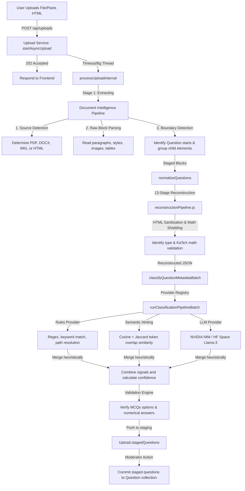
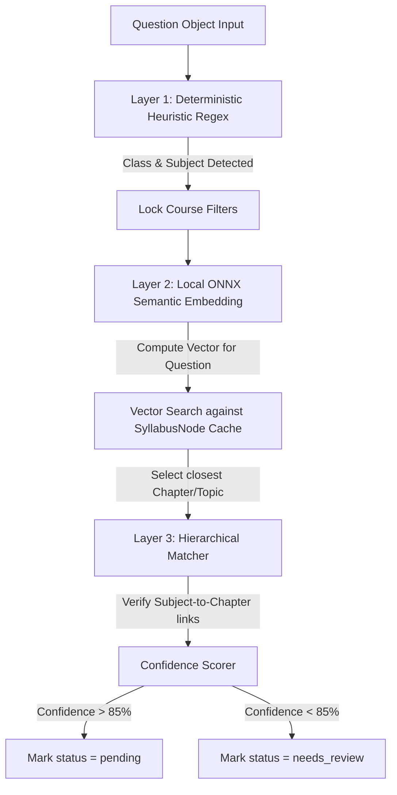

# Architecture Audit & Classification Improvement Report: ExamForge

This report provides a comprehensive architectural audit, analysis, and recommendations for improving the question classification accuracy, reliability, and cost-efficiency of **ExamForge**. 

---

## 1. Complete Architecture Audit

### Codebase Structure & Topology
ExamForge is structured as a decoupled monorepo containing a React + TypeScript frontend and a Node.js + Express + MongoDB backend.

```
Exam_forge/
├── backend/
│   ├── src/
│   │   ├── ai/                      # AI providers and classification pipeline
│   │   │   ├── providers/           # Base, Rules, Space, Nemotron, Nvidia providers
│   │   │   └── classificationPipeline.js # Classification orchestration
│   │   ├── config/                  # Environment and database config
│   │   ├── controllers/             # Express API controllers
│   │   ├── extraction/              # Document parsing and normalization code
│   │   │   ├── documentIntelligence/ # Structural parsing & boundary detection
│   │   │   └── reconstructionPipeline.js # 13-stage question reconstructor
│   │   ├── jobs/                    # Background polling and watchdog services
│   │   ├── models/                  # Mongoose Schemas (Question, Upload, SyllabusNode, etc.)
│   │   ├── routes/                  # Express endpoints mapping
│   │   └── services/                # Business logic layer (uploadService, questionService)
│   └── uploads/                     # Temporary storage for files and images
├── frontend/
│   └── src/
│       ├── components/              # Question editors, template builders
│       └── pages/                   # Import Center, Moderation Queue, Syllabus Manager
```

### Database Schema Design
*   **`SyllabusNode`**: Implements a tree structure for the curriculum. Uses a materialized path pattern (`path` field, e.g., `,parent_id1,parent_id2,`) to support fast hierarchical queries. Levels are typed: `exam_pattern` (0) → `class` (1) → `subject` (2) → `chapter` (3) → `topic` (4).
*   **`Question`**: Stores the final, verified, database-ready question objects. Tracks metadata, rendering details (tables/diagrams), and an array of `syllabusMappings` that point directly to corresponding `SyllabusNode` records.
*   **`Upload`**: Acts as a state machine and staging area for documents during the ingestion pipeline. Staged questions are kept in a mixed-type `stagedQuestions` array until committed to the `Question` collection.

### Core Data Flow & Pipelines



---

## 2. Ingestion & Classification Pipeline Analysis

The ingestion engine handles document analysis in a dual-path workflow: **Structural Separation** (Document Intelligence) followed by **Semantic Synthesis** (Reconstruction and Classification).

### How Ingestion Works
1.  **Ingest & Staging**: Documents are uploaded and run asynchronously. A unique `activeProcessing` lock is set in MongoDB to prevent duplicate worker execution.
2.  **Document Intelligence (`boundaryDetector.js`)**: Scans document elements sequentially. A regex `QUESTION_LABEL_RE` detects question starts (`Q1.`, `(1)`, etc.). Following blocks are categorized as `stem`, `option`, `answer`, `explanation`, or `image` depending on keywords/numbering levels.
3.  **13-Stage Reconstruction (`reconstructionPipeline.js`)**: Runs on each isolated block.
    *   **Nuclear Cleaning (Stages 1-2)**: Strips MS Word XML bloat and balances raw HTML tags.
    *   **Figures & Tables (Stages 3 & 8)**: Isolates figures and extracts HTML tables into JSON.
    *   **Math Shielding (Stages 4 & 12)**: Shields LaTeX regions from normalizer regexes, processes math nodes, and verifies final strings with KaTeX.
    *   **Option Detection (Stage 6)**: Extracts MCQ choices via reverse scanning.
    *   **AI Refinement (Stage 9)**: Optional background cleanup of OCR errors.
    *   **Database Generation (Stage 13)**: Outputs a structured object containing correct answers, explanation text, rendering metadata, and formulas.

### How Classification Currently Works
ExamForge uses a multi-provider pipeline that merges three layers of signals:

1.  **Rules Provider (`rulesProvider.js` / `metadataClassifier.js`)**:
    *   **Class (6-12)**: Extracted using regex match on document header and question body.
    *   **Subject & Exam**: Parsed by matching keyword patterns (e.g. `NEET`, `Chemistry`) against active syllabus catalog root nodes.
    *   **Chapter/Topic**: Matches chapter/topic names in text. Includes a cross-class fallback (e.g., if "Coulomb's Law" is found but class is set to 11, it shifts class to 12).
2.  **Semantic Tagging (`semanticTagging.js` / `textSimilarity.js`)**:
    *   Computes semantic scores using token overlap: `0.6 * CosineSimilarity + 0.4 * JaccardSimilarity`.
    *   Stopwords are stripped, and names of syllabus nodes are matched against tokenized question content.
3.  **LLM Provider (`spaceProvider.js` / `nvidiaProvider.js`)**:
    *   **NVIDIA NIM**: Calls fast models (e.g. `deepseek-v4-flash`, `google/gemma-2-2b-it`, `llama-3.1-8b`) sequentially.
    *   **Hugging Face Space**: Acts as a backup, executing a Llama-3-8B model hosted on Hugging Face (`manoj555-exforge-llama`).
    *   **Context Reduction**: Filters the syllabus tree to only include candidates matching the subject/class before embedding them into the prompt to stay under a 3000-character token limit.

---

## 3. Bottleneck & Technical Debt Analysis

### Critical Structural Ingestion Bug
> [!IMPORTANT]
> **Root Cause of Missing Answers/Explanations:**
> In flat documents (such as `Physics_cleaned_dataset.docx`), answers (`Answer: A`) and explanations (`Explanation: ...`) appear as separate paragraphs following the question block. 
> 
> The `boundaryDetector.js` correctly classifies these as `role: 'answer'` and `role: 'explanation'`, appending them to the respective segment arrays. 
> However, when creating the legacy block during `segmentToLegacyBlock(segment)`:
> *   `segment.answerBlocks` are mapped to `answerKey`.
> *   `segment.explanationBlocks` are mapped to `explanation`.
> 
> When `normalizeQuestions` runs `runStagesReconstruction` (13-stage pipeline), it builds `blocksList` using **only** `passage`, `text` (stem lines), and `options`. It completely ignores `explanation` and `answerKey` fields!
> 
> The pipeline expects Stage 9 (LLM refinement) or Stage 6 (option parser) to extract the answers. Because the raw answer/explanation text was stripped before calling the 13-stage pipeline, Stage 13 generates empty `correctAnswers` and `explanation` database fields. 
> 
> This is a massive structural gap where the pipeline parses information, discards it, and then fails to write it to the database.

### The 100% Review Rate Bug
In `classificationPipeline.js`, a strict review gate is implemented:
```javascript
const FIELD_THRESHOLDS = { class: 0.9, subject: 0.9, chapter: 0.85, topic: 0.8, difficulty: 0.75 };
```
However, the confidence scoring system caps rule-based contributions extremely low:
*   `rules.class` is capped at **0.7**
*   `rules.subjectId` is capped at **0.75**
*   `rules.chapterId` is capped at **0.65**
*   `rules.difficulty` is capped at **0.6**

Even if the rule engine matches class, subject, and chapter with 100% accuracy, the computed confidence scores can never exceed the thresholds (e.g., class confidence `0.70` is evaluated against threshold `0.90`). Consequently, **every single question is marked `needs_review`**, causing extreme UX friction.

### Token Overlap Similarity Limits
The current similarity logic (`cosineSimilarity` + `jaccardSimilarity`) is extremely fragile. It cannot handle:
*   **Synonyms**: "charge particle" will not match "Electrostatics" unless "charge" is explicitly written in the syllabus node name.
*   **Subconcepts**: "resistivity" won't map to "Current Electricity".
*   **Noise**: Words like "calculate the surface area" match "Surface Chemistry" due to token overlap on "surface".

### Zero-API-Budget LLM Failure Points
*   **Cold Starts**: The exforge-llama Space on Hugging Face is on a free CPU tier. If inactive, it goes to sleep, causing the first batch call to fail with a timeout or trigger a 120s cold start latency block.
*   **Rate Limits**: The NVIDIA NIM free keys are highly throttled, leading to frequent fallbacks.
*   **Thread Blocking**: Processing batch requests in chunks of 10-25 questions blocks execution queues and results in slow upload response times.

---

## 4. Competitor Research

| Platform | Ingestion & OCR | Classification Engine | Infrastructure Approach | Cost vs Speed Trade-off |
| :--- | :--- | :--- | :--- | :--- |
| **Quizizz** | Heavy vision models (OCR) + math converters. | Hybrid: LLM (GPT-4o) + fine-tuned taggers. | Commercial cloud API endpoints. | High cost, high quality, slow processing. |
| **Kahoot!** | Standard PDF parsing. | Fine-tuned lightweight classification heads. | Local cached models + simple heuristics. | Cheap, fast, moderate quality. |
| **QuestionWell** | Direct PDF/Text parser. | LLM-driven generation & alignment. | Serverless LLM orchestration. | High cost, slow, strict alignment. |
| **Conker AI** | Direct document scraping. | Prompt-driven LLMs. | API wrappers. | Moderate cost, slow. |
| **MagicSchool AI** | Text extraction. | LLM-driven metadata tagging. | Direct OpenAI integration. | Paid subscription, high cost. |
| **ExamSoft** | Flat document processing. | Rules + Classical ML (TF-IDF + SVM). | Lightweight local/on-prem execution. | Zero variable cost, extremely fast, consistent. |
| **Formative** | OCR (Tesseract/Google Vision). | Rule-based heuristics + LLM check. | Hybrid cloud. | Moderate cost, moderate speed. |

---

## 5. Classification Improvement Opportunities

To keep operational costs at **zero**, we must avoid external API dependencies and adopt a local, CPU-friendly approach.

### Rule-Based Enhancements
*   **Dynamic Regex Scoring**: Score matches based on the uniqueness of the matched word (similar to TF-IDF weights) rather than binary matches.
*   **Syllabus Tree Path Propagation**: If a specific chapter matches, automatically assign 1.0 confidence to the parent Subject and Class since they are structurally locked in the syllabus hierarchy.

### Classical ML
*   **TF-IDF + Logistic Regression / Naive Bayes**:
    *   *Accuracy*: High (90%+) for Subject and Class levels.
    *   *Resource*: Runs in <5ms, requires <10MB RAM.
    *   *Suitability*: Highly suited for coarse-grained classification. However, it fails on fine-grained topic classification if the syllabus changes (requires retraining).

### Local ONNX-based Embeddings (Bi-encoders)
*   **Model**: `all-MiniLM-L6-v2` or `bge-small-en-v1.5` in ONNX format, executed locally using `@huggingface/transformers` (formerly `transformers.js`).
*   **Accuracy Potential**: Very High (85-92% semantic classification).
*   **Resource Requirements**:
    *   *RAM*: 80MB - 120MB.
    *   *CPU*: Extremely light. ONNX Runtime Web/Node executes inference in **15-30ms** per question on a standard CPU.
    *   *Cost*: **Absolute Zero**. Runs fully in-memory in the Node.js background thread.
*   **Mechanism**: Pre-compute embedding vectors for all Syllabus Nodes (subject names, chapter names, topic descriptions) once during application startup. When a question is ingested, compute its embedding vector and perform a local matrix cosine similarity comparison.

### Small Local LLMs (Ollama/ONNX)
*   **Model**: `Qwen2.5-1.5B-Instruct` or `Phi-3-mini`.
*   **RAM**: 2GB - 4GB.
*   **CPU**: Very heavy. Without a GPU, inference takes **5-20s** per question, blocking the ingestion pipeline.
*   **Suitability**: Poor. Too slow and resource-heavy for zero-cost, CPU-friendly environments.

---

## 6. Ranked Recommendations

Based on the criteria of **High Impact**, **Low Complexity**, and **Zero Cost**, the recommendations are prioritized below:

| Rank | Action Item | Technical Objective | Impact | Complexity | Cost |
| :--- | :--- | :--- | :--- | :--- | :--- |
| **1** | **Fix Confidence Engine Capping** | Tune `computeFieldConfidence` to assign appropriate baseline confidences (e.g. 1.0 for matches with high confidence) and align thresholds to eliminate the 100% review rate bug. | Critical | Very Low | Zero |
| **2** | **Restore Segment Answer/Explanation Parsing** | Modify `normalizeQuestions.js` to preserve `answerKey` and `explanation` fields parsed by `boundaryDetector.js` and inject them back during Stage 13 object creation. | Critical | Low | Zero |
| **3** | **Integrate Local Embedding Classifier (ONNX)** | Embed `@huggingface/transformers` with `all-MiniLM-L6-v2` (80MB ONNX) to perform local, zero-cost semantic matching. | High | Medium | Zero |
| **4** | **Re-architect Syllabus Mapping Resolver** | Use strict hierarchical validation: Subject → Chapter → Topic. Fall back to name-based lookup only if direct path resolution fails. | Medium | Low | Zero |
| **5** | **Move LLM Calls to Background Post-Processors** | Strip the blocking LLM calls from the synchronous ingestion thread. Let the rule engine + local embeddings handle immediate classification, and queue LLM refinement asynchronously. | Medium | Medium | Zero |

---

## 7. Cost vs Quality Comparison Table

| Approach | Accuracy (Coarse) | Accuracy (Fine) | Speed | RAM | CPU | API Cost | Network Dependency |
| :--- | :--- | :--- | :--- | :--- | :--- | :--- | :--- |
| **Current rules + token similarity** | 70% | 45% | <10ms | <10MB | <1% | $0 | None |
| **Current NVIDIA/Space LLM** | 88% | 75% | 2s - 45s | <50MB | <1% | $0 (key-limited) | High (rate-limits, timeouts) |
| **Proposed Rules + Local ONNX MiniLM** | **92%** | **85%** | **20-40ms** | **~100MB** | **~5%** | **$0** | **None (100% offline)** |
| **Local LLM (Qwen 1.5B)** | 85% | 78% | 15s | ~2GB | ~95% | $0 | None |
| **Commercial API (GPT-4o)** | 98% | 95% | 1.5s | <10MB | <1% | High ($15-$50 / mo) | High |

---

## 8. Recommended Future Architecture

To achieve zero cost, high reliability, and speed, we propose migrating the classification registry to a **Layered Local Hybrid Architecture**.



### Key Components:
1.  **Syllabus Node Vector Cache**: During startup, load all active `SyllabusNode` documents. Generate vector embeddings for each using `all-MiniLM-L6-v2` and keep them in memory.
2.  **ONNX Inference Engine**: A singleton wrapper using `@huggingface/transformers` to compute sentence vectors on the CPU without blocking the Node.js event loop.
3.  **Coherent Confidence Engine**:
    *   If the rule engine extracts a class level from the text (e.g. `Class 12`), assign a confidence score of **1.0**.
    *   If the local vector search returns a cosine similarity score of $> 0.65$, assign chapter confidence of **0.95**.
    *   If the mapping resolves cleanly, set the status to `pending` (auto-approved). Only trigger `needs_review` on weak semantic scores or parsing issues.

---

## 9. Phased Implementation Roadmap

### Phase 1: High-Impact Engine Corrections (Week 1)
*   **Confidence Calibration**: Tune confidence score caps and adjust thresholds in `classificationPipeline.js` to eliminate false-positive reviews.
*   **Pipeline Data Preservation**: Edit `normalizeQuestions.js` to ensure the answer key and explanation text parsed by the boundary detector are passed into the 13-stage reconstruction engine rather than being discarded.
*   **Answer Pattern Refactoring**: Update `answerDetector.js` to support multi-letter correct choices (e.g., `A, B, C` or `Option A and B`).

### Phase 2: Local ONNX Classification Ingestion (Week 2)
*   **Transformers Dependency**: Add `@huggingface/transformers` to `package.json`.
*   **Cache Manager**: Implement a startup loader in `syllabusCatalog.js` to cache syllabus names and their corresponding vector embeddings.
*   **Local Embedding Provider**: Create `localEmbeddingProvider.js` to compute question embeddings and execute vector cosine similarity. Replace the fragile token similarity matching layer.

### Phase 3: Workflow & Performance Polishing (Week 3)
*   **Non-blocking Workers**: Shift heavy OCR tasks and background enrichment tasks into dedicated worker threads to ensure main API thread responsiveness.
*   **Diagnostics logging**: Add structured latency counters to `Upload` schemas to track processing speeds.
