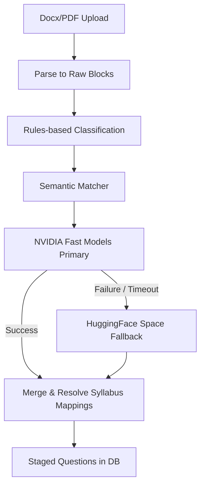

# AI Classification System Documentation

This document outlines the design and implementation of the AI-assisted question classification and cleanup system in ExamForge.

## System Overview

ExamForge utilizes a multi-tiered classification pipeline that integrates fast, local rules-based parsers, semantic matchers, and high-performance LLM providers to clean and categorize extracted exam questions.

## 1. Provider Tier & Fallback Logic

To optimize classification performance, accuracy, and API costs, we utilize the `NvidiaProvider` as the primary AI classification tier, with fallback to `SpaceProvider`.

The models are evaluated in the following order:
1. `deepseek-ai/deepseek-v4-flash`
2. `qwen/qwen3-next-80b-a3b-instruct`
3. `google/gemma-2-2b-it`
4. `mistralai/mistral-nemotron`
5. `meta/llama-3.1-8b-instruct`
6. `HuggingFace Space SpaceProvider` (Final fallback if all NIM models fail or are rate-limited)

## 2. In-Prompt OCR Cleanup

Before performing classification, questions undergo AI-assisted cleanup. The prompt explicitly instructs the LLMs to:
- Fix minor OCR/parser mistakes (e.g., stray characters, weird symbols).
- Fix spelling and grammatical issues.
- Standardize malformed answer labels (e.g., conversion from weird brackets to `(A)`, `(B)`).
- Clean up minor equation formatting issues without altering the semantic meaning of the questions.

## 3. Syllabus Mapping Resolution

During the merge phase of the classification pipeline:
- Duplicate subject nodes (e.g., JEE Physics vs CBSE Physics under Class 12 parent) are resolved.
- If a chapter/topic hint is present, the resolver scans child chapters and topics of candidate subjects to map the question to the correct syllabus tree.
- LLM hints are matched fuzzily against nodes in the syllabus tree.

## 4. Document-Level API Workflow

For E2E batch operations, a specialized workflow exposes the following endpoints (protected via authentication and authorized for `super_admin` and `faculty` roles):

- `POST /api/document-classification/upload`: Handles multipart file upload, parses the document into questions, loads the active database syllabus tree once, and creates an in-memory classification session.
- `POST /api/document-classification/batch/:sessionId`: Accepts `{ start, end }` indices to process a subset of questions in a single batch call. Logs performance metrics.
- `GET /api/document-classification/finalize/:sessionId`: Aggregates the batch results, writes a classification JSON report in `backend/reports/`, and returns a summary.

## 5. Metrics Logging

Performance and token usage are monitored via `backend/src/utils/metrics.js`, which appends logs to `backend/logs/classification_metrics.json`.
Logged fields:
- `timestamp`: ISO String
- `model`: Model name used for successful batch classification
- `batchSize`: Number of questions in batch
- `latencyMs`: API response time in milliseconds
- `sessionId`: Session UUID
- `start` & `end`: Question indices
