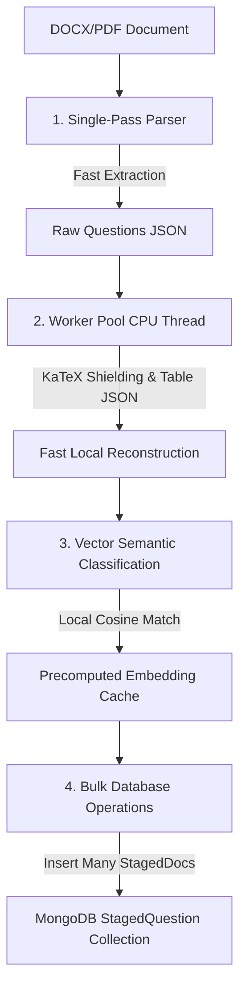

# Performance Ingestion & Classification Redesign Report

This report outlines the performance audit of the **ExamForge** ingestion and classification pipelines. It identifies severe bottlenecks, redundant CPU processing passes, synchronous thread-blocking hazards, and database inefficiencies. It then provides a redesign blueprint for a fast, local, zero-cost, and high-throughput pipeline capable of processing thousands of questions on modest hardware.

---

## 1. Performance Audit Findings

### A. Repeated Processing & Multiple Reconstruction Passes
1. **Triple Option Parsing**:
   * **Pass 1 (`boundaryDetector.js`)**: Runs `parseOptionLine()` during question segmentation to split options.
   * **Pass 2 (`normalizeQuestions.js`)**: Runs option validation and splitting logic during block normalization.
   * **Pass 3 (`reconstructionPipeline.js` Stage 6)**: Extracts stem and options *again* using `extractOptionsReverse()` and `splitOptionsByMarkers()`.
2. **Double DOM Parsing**:
   * The document is parsed to HTML in `extractDocxQuestions()`. The ingestion pipeline splits it into paragraphs. Then, Stage 5 (`DOM Block Extraction`) reconstructs HTML lists and paragraphs again inside each individual question block.
3. **Redundant Math Shielding**:
   * Math expressions are normalized and shielded in `normalizeQuestions.js`, but Stage 4 (`Semantic Math Shielding`) repeats this exact regex search and placeholder mapping on the rebuilt stem.

### B. Blocking Operations & Synchronous Bottlenecks
1. **Single-Thread Event Loop Blocking**:
   * The background worker (`processUploadInternal`) is launched using `setTimeout` on the main Node.js process. When parsing a document with 500+ questions, the heavy regex matching, HTML balancing, math string shielding, and KaTeX parsing are executed **synchronously** in chunks. This blocks the single-threaded Node.js event loop, preventing the backend from responding to client API requests.
2. **Synchronous LLM Checks**:
   * In `reconstructionPipeline.js` Stage 10 (Question Type Verification), if a question type is descriptive or option confidence is $< 0.70$, the pipeline makes a synchronous network request to the configured LLM provider to classify the question. This stalls block processing.

### C. Expensive AI Calls & Network Dependencies
1. **Remote LLM Classifiers**:
   * The exforge-llama Space on Hugging Face runs on a free CPU/GPU instance that goes to sleep after inactivity. A cold start triggers a **120-second timeout block**.
   * Batch requests are split into chunks of 10-25 and sent over HTTP. Under high load, these requests fail due to rate limits or connection resets.
2. **Lack of Semantic Precomputation**:
   * The current semantic tagger matches questions against syllabus nodes using token similarity on every single request. If the syllabus has 1,000 chapters/topics, it tokenizes and scores all 1,000 strings in JavaScript for every single question.

### D. Database & Memory Inefficiencies
1. **Frequent Syllabus Fetching**:
   * Every document upload calls `loadSyllabusCatalog()` which executes `SyllabusNode.find({ isActive: true }).lean()` and structures the tree from scratch. For a large catalog under multi-user concurrency, this floods MongoDB with redundant queries.
2. **Sequential Inserts on Commit**:
   * When staged questions are committed to the database, `commitStagedQuestions` runs `Question.create()` in a sequential loop. Committing 500 questions translates to 500 sequential write queries.
3. **MongoDB Document Size Cap (16MB Limit)**:
   * Staged questions are stored directly within the `Upload` document inside the `stagedQuestions` array. If an upload contains 1,000 questions containing raw HTML, embedded diagrams, and debug data, the size of the `Upload` document easily exceeds MongoDB's 16MB document cap, crashing the upload database operation.

---

## 2. Redesign: The High-Throughput Pipeline

To process thousands of questions smoothly on modest hardware, the architecture must transition from a **network-heavy, iterative** pipeline to a **local, single-pass, multithreaded** engine.



### Core Architecture Components

#### 1. Single-Pass Deterministic Parser
Replace the 13-stage reconstruction pipeline with a **deterministic single-pass compiler**.
* **Direct Structural Mapping**: Since `boundaryDetector.js` already groups the document into segments (stem, options, answer, explanation), map these structures directly to the database object.
* **Eliminate Re-splitting (Stage 5/6)**: Trust the boundary detector's option groupings. Skip Stage 5 DOM extraction and Stage 6 reverse option scanning entirely.
* **Consolidated Math Engine**: Perform math shielding, LaTeX normalization, and KaTeX validation in a single pass over the elements.

#### 2. In-Memory Syllabus & Vector Cache
Cache the syllabus tree in RAM.
* **Startup Initialization**: Load all `SyllabusNode` records on startup. Cache them in a global `SyllabusCache` singleton.
* **Precomputed Embeddings**: Generate vector embeddings for all syllabus chapters and topics using a local model on startup. Keep these vectors cached in a Float32 array in RAM.
* **Pub-Sub Synchronization**: Update the cache only when the syllabus is edited (using Mongoose middleware hook or Redis pub-sub).

#### 3. Local ONNX Inference Engine
Deploy a local embedding model for semantic classification.
* **Library**: `@huggingface/transformers` running the ONNX version of `all-MiniLM-L6-v2` (80MB file size).
* **Execution**: Load the model once at startup.
* **Classification**: Embed the question text and calculate cosine similarity against the precomputed syllabus vectors in RAM. This takes $< 30\text{ms}$ on a single CPU core, requires zero network calls, and costs nothing.

#### 4. Real Multi-threading via Worker Threads
Remove ingestion from the main Node.js event loop.
* **Threadpool**: Use Node's `worker_threads` (via a library like `piscina`) to spawn background parser workers.
* **Resource Offloading**: The main Express thread handles API requests. Document parsing, OCR, and vector inference are offloaded to background threads. This keeps the server responsive.

#### 5. Database Optimization
* **Split Staging Collection**: Create a dedicated `StagedQuestion` collection linked to the `Upload` document by `uploadId`.
  ```javascript
  const stagedQuestionSchema = new mongoose.Schema({
    uploadId: { type: ObjectId, ref: 'Upload', index: true },
    questionText: String,
    options: Array,
    ...
  });
  ```
  This eliminates the 16MB document size limit on `Upload` documents and allows paging staged questions easily.
* **Bulk Database Commits**: Modify `commitStagedQuestions` to use `Question.insertMany(questions)` instead of sequential loops.

---

## 3. Comparison of Current vs. Redesigned Architecture

| Design Characteristic | Current Architecture | Proposed Performance Architecture |
| :--- | :--- | :--- |
| **Parsing Engine** | Multi-pass (extracts blocks, groups segments, converts to legacy, runs 13-stage parsing). | Single-pass (direct structural mapping from boundary segments to question fields). |
| **Option Extractor** | Repeated (runs 3 times across different files). | Single-run (parsed once at boundary detection). |
| **Syllabus Load** | Database Query (executed on every upload). | Memory Cache (loaded once at startup). |
| **Semantic Classifier** | Remote LLMs + local token overlap (rate-limited HTTP requests / fragile bag-of-words similarity). | Local ONNX Embedding Vector Search (MiniLM-L6-v2 cosine similarity cache). |
| **Processing Thread** | Main Node.js Thread (blocks event loop). | Background Worker Thread Pool (piscina/worker_threads). |
| **Staging Storage** | Nested in `Upload` Document (unscalable, capped at 16MB). | Dedicated `StagedQuestion` collection (scalable, supports pagination). |
| **Database Writes** | Sequential loop (`Question.create()` per question). | Bulk operation (`Question.insertMany()`). |
| **Operational Cost** | Variable (prone to future API costs / network failures). | Zero ($0 variable cost). |

---

## 4. Phase-by-Phase Redesign Roadmap

### Phase 1: Structural Repair & Decoupling (Immediate)
* **Separate Staging Schema**: Create the `StagedQuestion` model and refactor database updates in `uploadService.js` to write to this new collection.
* **Bulk Commit**: Refactor `commitStagedQuestions` to use `insertMany()` for database persistence.
* **Cache Syllabus**: Implement a singleton cache for `loadSyllabusCatalog()` in `syllabusCatalog.js` to avoid redundant database calls.

### Phase 2: In-Memory Semantic Classifier (Local AI)
* **Local ONNX Model**: Integrate `@huggingface/transformers` and cache `all-MiniLM-L6-v2` in Node.js.
* **Precomputed Embedding Cache**: Write the caching loader that runs on startup, embeds all syllabus chapter and topic strings, and stores their vectors in RAM.
* **Embedding Matcher**: Replace `combinedTextSimilarity` (token similarity) with local cosine similarity vector matching.

### Phase 3: Single-Pass Parsing & Worker Thread Pool
* **Streamlined Pipeline**: Modify `normalizeQuestions.js` to bypass Stages 1, 2, 5, and 6 if blocks are already structured. Extract options and stems in a single pass.
* **Threadpool Integration**: Integrate `piscina`. Move `processUploadInternal` parsing loops into a worker file (`parsingWorker.js`) executed in background CPU threads.
* **Telemetry**: Track queue latencies and peak memory usage to display on the admin page.
